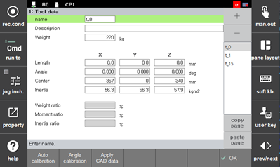
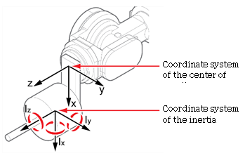
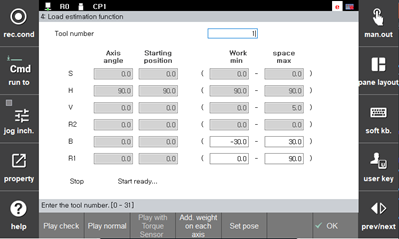

# 7.7.3 负载估算功能

负载估算是一个通过某种操作自动计算附加在机器人前端的工具的物理特性（质量、重心、惯性）的功能。

操纵器信息（质量、重心、每个链接的惯性）已经注册在控制器中。然而，由于工具在必要时将被附加到机器人前端，因此需要输入工具信息。工具物理特性的信息包括工具质量（kg）、重心位置和安全使用机器人所需的惯性。

如果CAD数据包含工具的物理特性信息，可以通过触摸`[system]`按钮 - `[3: Robot Parameter - 1: Tool Data] ([3: Robot Parameter - 1: Tool Data])`菜单直接输入工具质量、重心位置和惯性。

工具数据设置的信息如下。

* `[Weight]`：安装在机器人前端的工具的总重量（kg）
* `[Center]`：从机器人法兰面中心到工具重心位置在x、y、z方向的距离（mm）
* `[Inertia]`：关于工具坐标的工具的惯性矩（kg/m2）。惯性矩将根据重心周围的x、y和z轴的质量分布确定，若负载质量分布越远离旋转轴，则惯性将增加。
* 工具数据坐标系统：惯性和重心将相对于x、y和z轴方向表示为数值。

然而，在许多情况下，从CAD数据中确定工具的物理特性如质量、惯性和重心是困难的。这时，您可以使用机器人控制器中的负载估算功能来检查工具的物理特性。

1. 触摸`[6: Auto Calibration - 4: Load Estimation Function] ([6: Auto Calibration - 4: Load Estimation Function])`菜单。

2. 在触摸`[Add. Weight on Each Axis]`按钮后，输入每个轴的附加重量信息。

如果在有附加重量的情况下执行负载估算功能，将判定到所有安装在机器人的重量物体都位于前端。为了准确的负载估算，应该输入每个轴的附加重量信息。

3. 在通过移动机器人的主轴将机器人移动到安全区域后，触摸`[Set pose]`按钮。

4. 在触摸`[Wrist Axis Operation Area]`按钮后，指定在负载估算操作中将使用的手腕轴的操作区域。负载估算可以在与附近设施及操纵器没有干扰的操作区域中进行。

如果不支持`[Wrist Axis Operation Area]`按钮，则跳过此步骤，执行下一步骤。

5. 触摸`[Play check]`按钮。然后，当机器人以低速度运行时，您可以检查与附近设施或操纵器的干扰。

6. 在输入安装在机器人上的工具编号后，触摸`[Play Normal]`按钮。然后，将执行负载估算，计算工具的物理特性。

7. 检查负载估算结果后，触摸`[End]`按钮。然后，计算的工具物理特性将注册在工具编号中。


* 附加重量是用户连接到机器人的所有设备的总体重量，如焊接装置和焊接信号线继电器盒，但不包括安装在机器人前端的工具。
* 
  在某些机器人中将不支持手腕轴操作区域功能。

* 需要注意的是，负载估算功能可能无法执行，具体取决于手腕轴操作区域功能的设置值。
* 有关负载估算功能的详细信息，请参阅“负载估算功能手册”。
