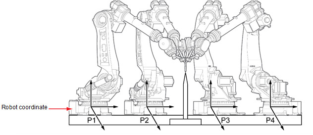

# 7.7.4.2 基础轴校准程序教学

1. 在空间中建立一个参考点，然后记录第一个参考点。

2. 将基础轴移动超过 200 mm，并将相同的点记录为第二步。

3. 在与第二步中移动的方向相同的方向上移动 200 mm 或更多，然后将相同的点记录为第三步和第四步。


* 使用已完成机器人校准（轴原点和工具长度的优化）的工具来教学行程轴校准程序。
* 
  记录步骤时，使用工具编号进行基础轴校准。

* 
  尽可能设置基础轴在记录步骤之间的移动距离来记录位置。
