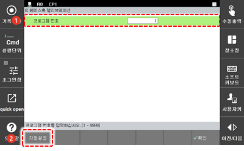
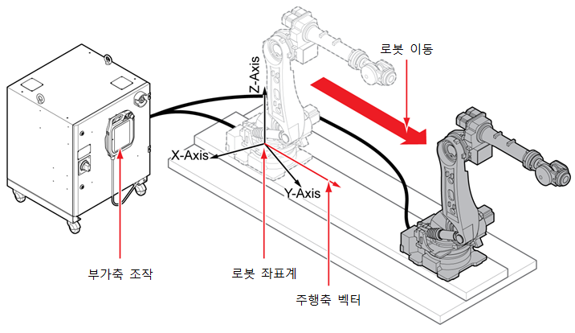

# 7.7.4.2 교시 기반 베이스축 캘리브레이션


* 해당 사항은 \[교시 기반 베이스축 캘리브레이션\] 기능에 대한 내용입니다. \[센서 기반 베이스축 캘리브레이션\] 기능에 대한 내용은 다음 페이지를 참고하십시오.


#### 캘리브레이션 프로그램 티칭

1.	공간 상의 기준점을 마련하여 첫 번째 기준점을 기록하십시오.

2.	베이스 축을 200 mm 이상 이동하여 동일점을 두 번째 스텝으로 기록하십시오.

3.	2번 단계에서 이동한 방향과 동일한 방향으로 200 mm 이상씩 이동하며 동일점을 세 번째와 네 번째 스텝으로 기록하십시오.


* 로봇 캘리브레이션\(축 원점 및 툴 길이 최적화\)이 완료된 툴을 이용하여 주행축 캘리브레이션 프로그램을 티칭하십시오.
* 스텝 기록 시 베이스축 캘리브레이션을 위한 툴 번호로 기록하십시오.
* 기록 스텝 간 베이스축의 이동 거리는 가능한 한 멀게 설정하여 위치를 기록하십시오.


#### 캘리브레이션 실행

1.	`6: 자동 캘리브레이션 - 6: 베이스축 캘리브레이션 - 1: 교시 기반 캘리브레이션` 메뉴를 터치하십시오.

2.	베이스축 캘리브레이션용 프로그램 번호를 입력한 후 `자동설정` 버튼을 터치하십시오.

3.	베이스축의 설치 방향 벡터값을 확인한 후 `[확인]` 버튼을 터치하십시오.

#### 캘리브레이션 후 조작

베이스축 캘리브레이션 후에 베이스축을 조그 조작하면 생성된 베이스 축의 방향 벡터로 주행한 거리가 현재의 좌표값으로 환산됩니다.

1. 작업 영역의 패널 스택 우측 상단의 \[+\] 버튼을 터치한 후 패널 선택창에서 \[포즈\]를 터치하십시오. 베이스축의 이동에 따른 좌표계의 환산값이 나타납니다.
2. 베이스축을 조그 조작하십시오. 베이스축 방향으로 주행한 거리가 X, Y, Z 값으로 환산되어 포즈 정보창에 나타납니다
3. 통상적인 방법으로 스텝을 기록하고 재생하십시오.


조그 좌표계를 툴 좌표계로 설정하고 베이스축을 조그 조작하여 베이스축의 정상 캘리브레이션 여부를 확인하십시오. 툴 끝 고정 동작이 실행되면 베이스축이 정상적으로 캘리브레이션된 것입니다.


