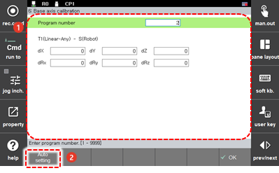

# 7.7.4.3 基座轴校准执行

1. 触摸 `[6: Auto Calibration - 6: Base Axis Calibration] ([6: Auto Calibration  - 6: Base Axis Calibration])` 菜单。

2. 在输入基座轴校准的程序编号后，触摸 `[Auto Setting]` 按钮。

    

3. 在检查基座轴的安装方向向量值后，触摸 `[OK]` 按钮。