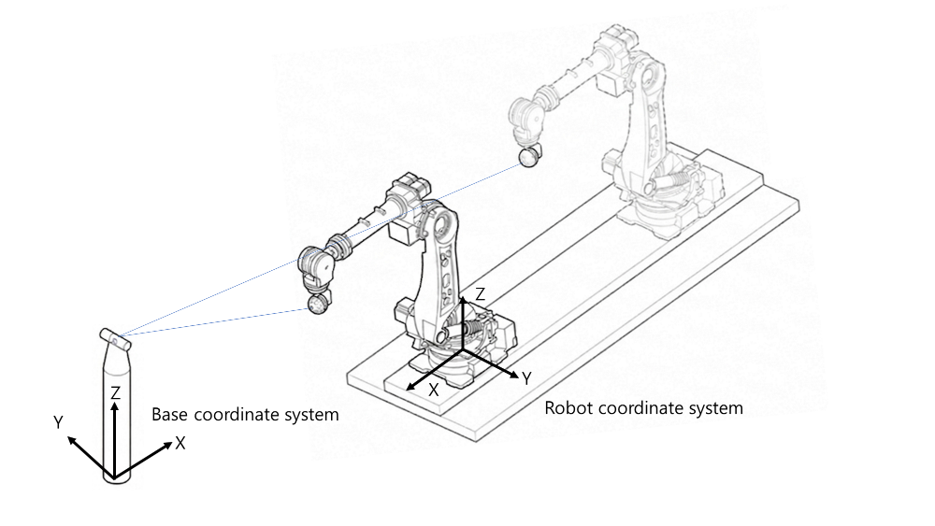
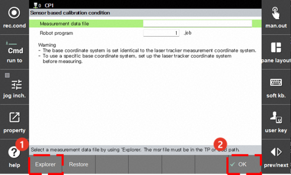
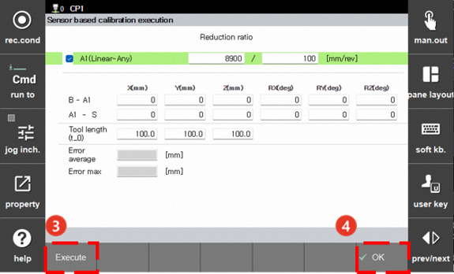
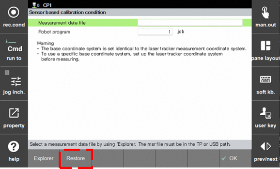

# 7.7.4.3 Sensor based Base Axis Calibration



* This section covers the **[Sensor based Base Axis Calibration]** feature. This feature is supported from version V70.06-00 and later.


#### Teaching Calibration Program and Measuring Data

1. Install the laser tracker in a position where various poses of the robot and base axes can be measured.

2. Set the sensor coordinate system of the laser tracker to the desired position and orientation. This coordinate system will be used as the base coordinate system of the controller. Set the position and orientation of the coordinate system for easy robot control.

3. With all base axes located at their origins, move the robot through various positions and poses to measure 20 or more positions, and record these positions into a program.

    * When doing so, record the initial 3 positions with a fixed orientation such that they do not lie on a single straight line.

    * Generally, a larger amount of measurement data allows for more accurate calibration.


* Saving the calibration results may alter the tool length associated with the tool number used for program recording. Select a tool number where changing the tool length is acceptable when recording the program.


4. With the robot fixed, move only the base axes to measure positions and record them into the program.

    * Do NOT move two or more base axes simultaneously.

    * Measure and record at least 5 positions per base axis.

    * Measurement and recording for a single base axis must be done continuously without interspersing positions from other base axes.   If recorded positions for multiple base axes are mixed alternately in the program, calibration cannot be performed properly.

    * Additionally, the number of recorded positions must not exceed 30 per axis, and the total number of recorded positions must not exceed 100.

5. Organize the measured position data in X, Y, Z format to create a file (Format: ASCII, Extension: MSR, Unit: mm).

#### Executing Calibration
1. After saving the position data file into a removable storage device, connect the removable storage device to the teach pendant. The `[USB]` icon (\) will appear in the status bar of the ${cont_model} teach pendant screen.

2. Touch `6: Auto Calibration > 6: Base Axis Calibration > 2: Sensor based Calibration`.

3. Touch the `[Explorer]` button  to select the position data file, and then select the robot program used for measurement.

4. Touch the `[OK]` button . The screen will switch to the Sensor based Calibration execution screen.

5. On the Sensor based Calibration execution screen, select whether to calibrate the reduction ratio. Enabling this feature will update the reduction ratio of the base axis after calibration.

6. Touch the `[Execute]` button  on the Sensor based Calibration execution screen. After optimizing parameters for a moment, the calibration results will appear.

7. Check the calibration results, then touch the `[OK]` button .

8. A message will appear asking whether to save the calibration result values. If saved, the tool length for the tool number used in the program and the base axis reduction gear ratio will be modified. Verify and save the settings.

9. In Pose Monitoring, the X, Y, Z values of the Cartesian coordinate system will be output with respect to the set base coordinate system.

#### Verification After Calibration

1. If calibration was performed normally and saved, the X, Y, Z values of the Cartesian coordinate system in Pose Monitoring must match the laser tracker's measured values. Move the robot and base axes to an arbitrary position, then measure the position with the laser tracker. Check whether the measured values match the coordinate values in Pose Monitoring. It is normal if the difference between the measured values and the Pose Monitoring coordinate values is within 3 mm.

2. You can also verify whether the base axis calibration was successful by setting the jog coordinate system to the Tool Coordinate System and jog operating the base axis. If only the base axis moves while the tool tip remains fixed in position, the base axis calibration has been performed normally.

#### Restoring Calibration Data

When Sensor based Base Axis Calibration is executed and the results are saved, the calibration data is backed up separately as a base_axis_calibration.json file in the /ata0:2/lib/hi6/backup/ path.   If calibration data is lost due to operations such as system initialization, it can be restored using the backed-up file. (Note: Restoration is not possible if encoder data was initialized by performing a serial encoder reset.)

1. The "Restore" button is enabled if the base_axis_calibration.json file exists in the /ata0:2/lib/hi6/backup/ path.

2. After performing restoration, restarting the power will apply the previously performed base axis calibration data. Note that tool length data will not be restored.

