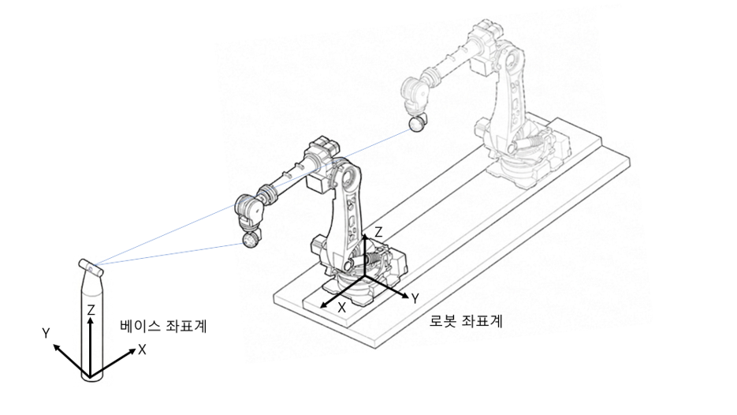
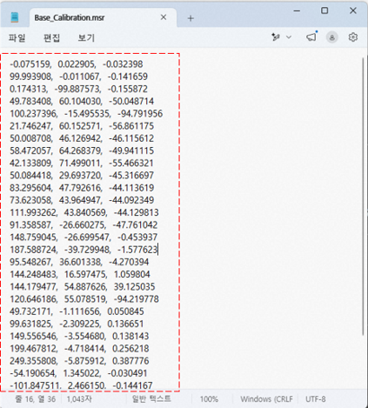
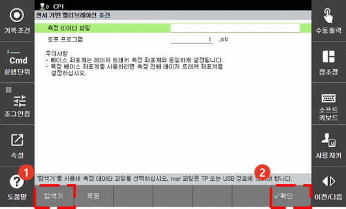
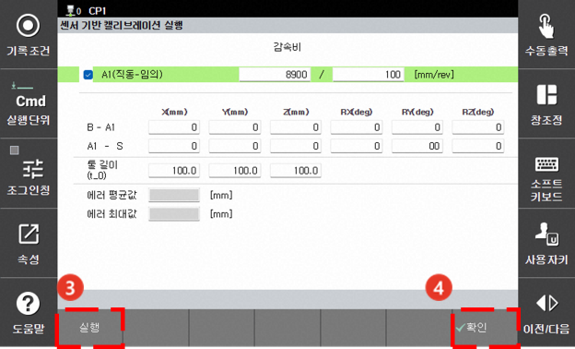
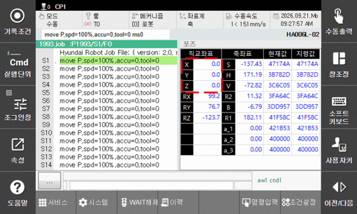
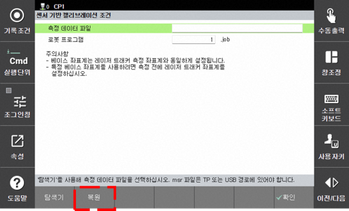

# 7.7.4.3 센서 기반 베이스축 캘리브레이션


* 해당 사항은 \[센서 기반 베이스축 캘리브레이션\] 기능에 대한 내용입니다. 해당 기능은 V70.04-00 및 이후 버전부터 지원됩니다.


#### 캘리브레이션 프로그램 티칭 및 데이터 측정

1. 로봇과 베이스 축의 다양한 자세를 측정할 수 있는 위치에 레이저 트래커를 설치하십시오.

2. 레이저 트래커의 센서 좌표계를 원하는 위치와 방향으로 설정하십시오. 이 좌표계는 제어기의 베이스 좌표계로 활용됩니다. 로봇 제어가 편리하도록 좌표계의 위치와 방향을 설정하십시오.

3. 모든 베이스 축들이 원점에 위치한 상태에서 로봇의 위치와 자세를 다양하게 움직여 20 점 이상의 위치를 측정하고 위치를 프로그램으로 기록하십시오. 이 때, 초기 3 점은 방향이 고정된 상태에서 같은 평면 상에 존재하지 않도록 위치를 기록합니다. 일반적으로 측정 데이터의 개수가 많을수록 보다 정확한 캘리브레이션이 가능합니다.


* 프로그램 기록에 사용한 툴번호는 캘리브레이션 결과를 저장할 때, 툴길이가 변경될 수 있습니다. 툴길이가 변경되어도 무관한 툴번호를 선택하여 프로그램을 기록하십시오.


4. 로봇은 고정된 상태에서 베이스 축만 움직여 위치를 측정하고 위치를 프로그램으로 기록하십시오. 이 때, 동시에 두 축 이상의 베이스 축을 움직이지 마십시오. 기록 위치는 하나의 베이스 축 당 최소 5점 이상, 권장 10 점 이상을 측정 및 기록하십시오. 또한, 하나의 축 당 기록위치가 50점을 초과, 전체 기록 위치가 100점을 초과할 수 없습니다.

5. 측정한 위치 데이터를 X, Y, Z 형식으로 정리하여 파일(형식: ASCII, 확장자: MSR)을 생성하십시오.

#### 캘리브레이션 실행

1. 생성한 위치 데이터 파일을 이동식 저장 장치에 저장한 후 이동식 저장 장치를 티치 펜던트에 연결하십시오. ${cont_model} 티치 펜던트 화면의 상태 표시줄에 \[USB\] 아이콘\(\)이 나타납니다.

2. `6: 자동 캘리브레이션 - 6: 베이스축 캘리브레이션 - 2: 센서 기반 캘리브레이션` 메뉴를 터치하십시오.

3. `[탐색기]` 버튼 을 터치하여 위치 데이터 파일을 선택한 후 측정에 사용한 로봇 프로그램을 설정하십시오.

4. `[확인]`버튼 을 터치하십시오. 센서 기반 캘리브레이션 실행 화면으로 전환됩니다.

5. 센서 기반 캘리브레이션 실행 화면에서 감속비 캘리브레이션 여부를 선택하십시오. 해당 기능을 활성화하면 캘리브레이션 후 베이스 축의 감속비가 변경됩니다.

6. 센서 기반 캘리브레이션 실행 화면에서 `[실행]` 버튼 을 터치하십시오. 잠시동안 파라미터를 최적화 한 후 캘리브레이션 결과가 나타납니다.

7. 캘리브레이션 결과를 확인한 후 `[확인]` 버튼 을 터치하십시오. 

8. 캘리브레이션 결과값을 저장할 지 묻는 메세지가 뜹니다. 이 때, 저장하게 되면 프로그램에 사용된 툴번호에 대한 툴길이와 베이스 축 감속비가 변경됩니다. 확인 후 저장하십시오.

9. 포즈 모니터링에서 직교 좌표계의 X, Y, Z값이 설정한 베이스 좌표계에 대하여 출력됩니다.

#### 캘리브레이션 후 확인

1. 캘리브레이션이 정상적으로 수행됐고, 저장됐다면 포즈 모니터링에서 직교 좌표계의 X, Y, Z값이 레이저 트래커의 측정값과 일치해야 합니다. 임의의 위치로 로봇과 베이스 축을 이동한 다음 레이저 트래커로 위치를 측정하십시오. 측정값과 포즈 모니터링의 좌표값이 일치하는지 확인하십시오. 측정값과 포즈 모니터링의 좌표값 차이가 3 mm 이내이면 정상입니다.

2. 또한, 조그 좌표계를 툴 좌표계로 설정하고 베이스 축을 조그 조작하여 베이스 축의 정상 캘리브레이션 여부를 확인할 수 있습니다. 툴 끝이 고정된 채 베이스 축만 움직인다면 베이스 축 캘리브레이션이 정상적으로 수행된 것 입니다.

#### 캘리브레이션 데이터 복원

센서 기반 베이스축 캘리브레이션을 수행하고 결과를 저장하면 /ata0:2/lib/hi6/backup/의 경로에 base_axis_calibration.json 파일로 캘리브레이션 데이터가 별도로 보관됩니다.  
시스템 초기화 등의 조작으로 인해 캘리브레이션 데이터가 사라졌을 때 보관된 파일을 이용해서 복원이 가능합니다. (단, 시리얼엔코더 리셋을 수행하여 엔코더 데이터가 초기화된 경우에는 복원이 불가합니다.)

1. /ata0:2/lib/hi6/backup/의 경로에 base_axis_calibration.json 파일이 존재하는 경우에 "복원" 버튼이 활성화 됩니다.
2. 복원을 수행한 후 전원을 재투입하면 이전에 수행한 베이스 축 캘리브리이션 데이터로 적용됩니다. 단, 툴길이 데이터는 복원되지 않습니다.

