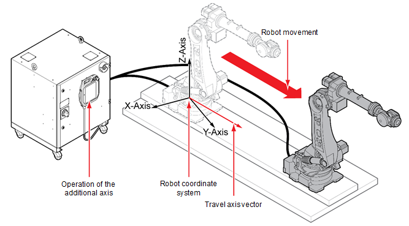

# 7.7.4.4 基座轴校准后的操作

如果在执行基座轴校准后移动基座轴，基座轴创建的方向向量中的行程将转换为当前坐标值。

1. 触摸工作区面板堆栈右上角的`[+]`按钮，然后在面板选择窗口中触摸`[Pose]`。

2. 移动基座轴。沿基座轴移动的距离将转换为X、Y和Z值，并在位置信息窗口中显示。

3. 按照 usual way 记录和回放步骤。


将 jog 坐标系统设置为工具坐标系统，并移动基座轴以检查基座轴是否正确校准。如果执行了工具提示固定操作，则表示基座轴已正确校准。
