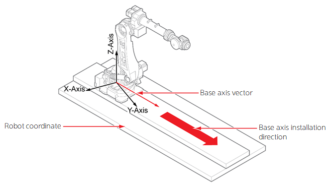

# 7.7.4 基座轴校准

基座轴校准是一个用于校准轴的安装方向的功能。

几乎不可能将基座轴安装到完全匹配机器人的坐标系统的某个方向（X、Y或Z）。当您使用基座轴校准功能在控制器中计算基座轴的方向时，可以提高包括基座轴在内的系统的线性插值轨迹的性能。

在机器人安装在基座轴上后，此功能使得可以通过找到机器人安装的任何基座轴的方向向量来执行位置插值。

通常，基座轴用于将机器人移动到操作位置。在特殊情况下，基座轴还可用于保证机器人在基座轴上移动时的线性轨迹。

* 当两个经过基座轴校准的机器人传送工件时（未来将支持多机器人）
* 当您需要在操作基座轴时执行插值时