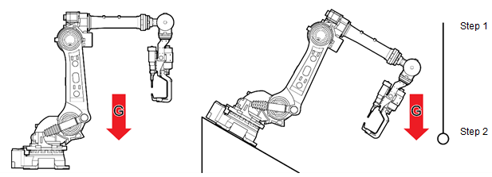
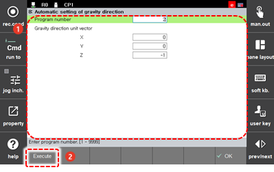

# 7.7.5 重力方向自动设置

${cont_model} 控制器基于动态，因此设置重力方向非常重要。

通常，机器人安装方向垂直于重力方向，如下所示。如果机器人斜放在地面上，则需要在机器人控制器中设置重力方向。在此时，可以使用自动重力方向设置功能。

设置重力方向的方法如下。

1.	在外部附加一个重量以指示重力方向，然后教学两个点（步骤1，步骤2）在重力作用的方向上。

2.	触摸 `[6: 自动校准 - 8: 重力方向的自动设置] ([6: 自动校准 - 8: 重力方向的自动设置])` 菜单。

3.	在输入程序编号后，触摸 `[执行]` 按钮。然后，方向向量将被计算并显示。

    

4.	在检查方向向量值后，触摸 `[确定]` 按钮。然后，方向将被设置为重力方向。