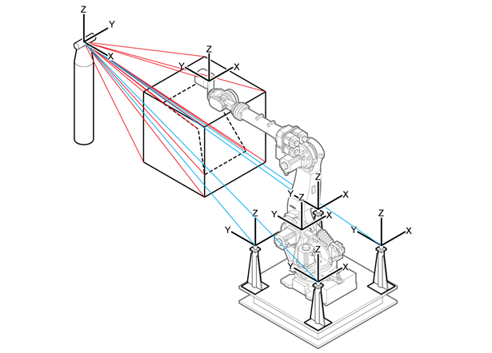
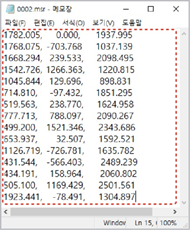
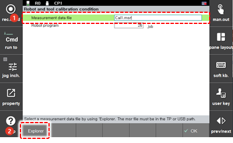
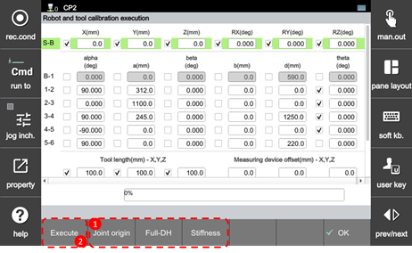
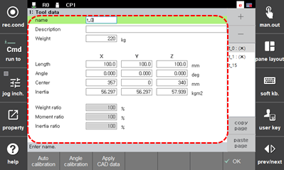
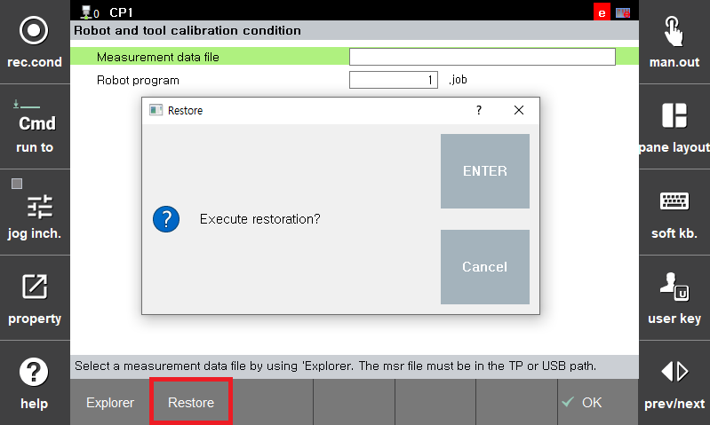

# 7.7.6 Calibration of the Robot and Tool

The robot and tool calibration function will be used in an environment where the position of the robot can be measured with a 3D measuring device.

1.	After selecting the position to be measured at the tooltip of the robot, measure the position of more than 15 points while moving the position and posture of the robot in various ways, and record the robot positions as a program.

    

2.	Organize the measured robot's position data \(measuring point data\) in X, Y, and Z formats, and then create a file \(Format: ASCII Extension: MSR\). 

    

3.	After saving the position data file into a removable storage device, connect the removable storage device to the teach pendant. The `[USB]` icon \( \) will appear in the status bar of the ${cont_model} teach pendant screen.

4.	Touch the `[6: Auto Calibration  - 9: Robot and Tool calibration condition]` menu.

5.	Touch the `[Explorer]` button to select a position data file and set the robot program used for the measurement.

    

6.	Touch the `[OK]` button. Then, the screen will switch to the robot and tool calibration screen.

7. On the robot and tool calibration execution screen, select the type of calibration parameter from , and then touch the `[Execute]` button.  
The system optimizes the selected parameters for a short period, after which the calibration results are displayed.  
By default, the axis origin and tool length parameters are selected. If calibration is required for additional error parameters, such as link lengths and joint angle offsets, select the `[Full-DH]` parameter.  
To include joint stiffness in the calibration, select the `[Stiffness]` option.  
When calibrating using the Full-DH parameters or including joint stiffness, position measurements at 30 or more points using a high-accuracy measuring device are required.  
If calibration is performed using measurement data with relatively large errors obtained from an inaccurate measuring device, the calibration results may sometimes be highly inaccurate. Exercise caution when performing the calibration.

    

8. After checking the calibration results, touch the `[OK]` button. The calibration results are automatically applied to the axis origin and tool integer.  
If the calibration includes joint stiffness, the gravity compensation function can be enabled from `System``Control parameter``Control environment setting`.  
When the gravity compensation function is enabled, the robot predicts and compensates for the deflection caused by the configured tool payload. As a result, the robot can achieve more accurate positioning.  
If the tool payload information is changed, the predicted deflection also changes. As a result, the robot may move to a different position than before.  
When the gravity compensation function is enabled, the robot cannot move to steps recorded as encoder values. Keep this in mind when operating the robot.

9.	Touch the `[3: Robot Parameter  - 1: Tool Data]` menu. Then, you can check the robot calibration execution result.

    

 


The axis origin and tool length X, Y, and Z values of the axes 2-5 \(H, V, R2, and B axes\) of the calibration parameter are selected. To calibrate the tool only, perform execution after deselecting the value of each axis.


 

#### Restore calibration data

When performing robot and tool calibration, the calibration data is stored separately as a calibration.json file in the path /ata0:2/lib/hi6/backup/.  
If calibration data is lost due to operations such as system initialization, it can be restored using the stored file. (However, if the encoder data has been initialized by performing a serial encoder reset, it cannot be restored.)

1. The "Restore" button will be activated if the calibration.json file exists in the path /ata0:2/lib/hi6/backup/.
2. After performing a restore and powering on again, the previously performed robot and tool calibration data will be applied.

