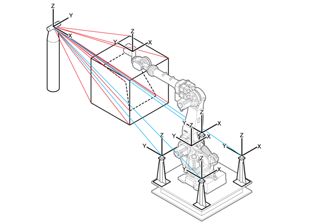
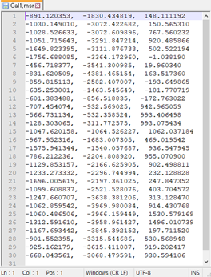
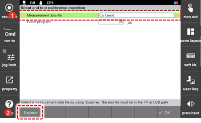
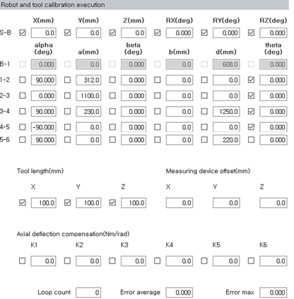
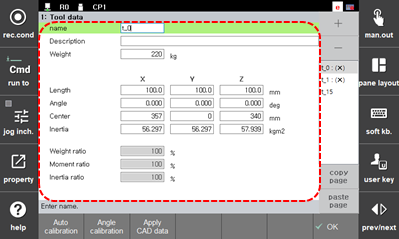

# 7.7.6 Calibration of the Robot and Tool

The robot and tool calibration function will be used in an environment where the position of the robot can be measured with a 3D measuring device.

1.	After selecting the position to be measured at the tooltip of the robot, measure the position of more than 15 points while moving the position and posture of the robot in various ways, and record the robot positions as a program.

    

2.	Organize the measured robot’s position data \(measuring point data\) in X, Y, and Z formats, and then create a file \(Format: ASCII Extension: MSR\). 

    

3.	After saving the position data file into a removable storage device, connect the removable storage device to the teach pendant. The \[USB\] icon \( \) will appear in the status bar of the Hi6 teach pendant screen.

4.	Touch the \[6: Auto Calibration &gt; 9: Robot and Tool calibration condition\] menu.

5.	Touch the \[Explorer\] button to select a position data file and set the robot program used for the measurement.

    

6.	Touch the \[OK\] button. Then, the screen will switch to the robot and tool calibration screen. 

7.	Touch the \[Execute\] button on the robot and tool calibration execution screen. Then, the calibration results will appear.

    

8.	After checking the calibration result, touch the \[OK\] button. Then, the calibration result will be automatically applied to the axis origin and tool integer. 

9.	Touch the \[3: Robot Parameter &gt; 1: Tool Data\] menu. Then, you can check the robot calibration execution result.

    

 


The axis origin and tool length X, Y, and Z values of the axes 2–5 \(H, V, R2, and B axes\) of the calibration parameter are selected. To calibrate the tool only, perform execution after deselecting the value of each axis.


