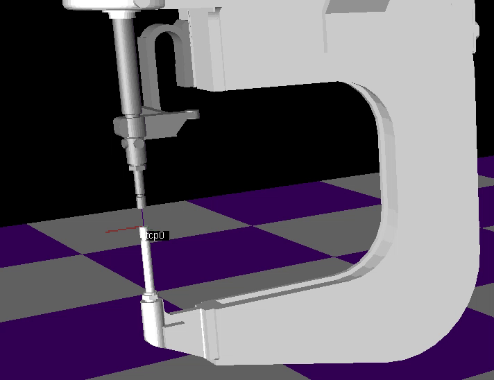
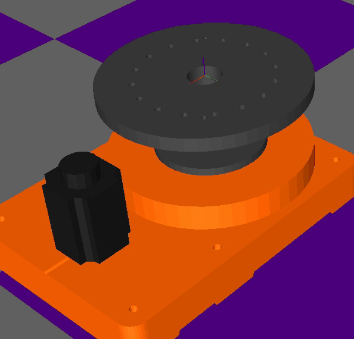
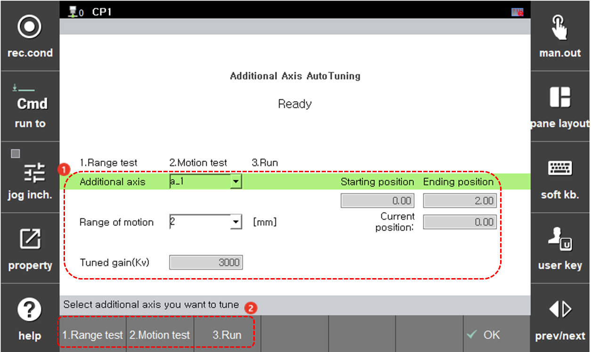

# 7.7.7 Additional Axis Autotuning

* Available from version V60.28-00.
 

### A. Overview

This function finds the optimal gain by moving the additional axis within the range set by the user. And it can be used when the additional axis does not have a proper gain set, resulting in noise or poor control performance.

|  |  |
|---|---|
| Linear axis motion | Circular axis motion |

### B. Tuning Description

  **Setting before tuning**

`Additional axis`: Select the additional axis you want to tune.

`Range of Motion`: Set the additional axis motion range(Linear axis: 2, 5, 10[mm] / Circular axis: 2, 5, 10[deg]). Adjust the position of the additional axis through jog, to set the appropriate additional axis motion range. Larger motion ranges result in better tuning(Motion beyond the current specification's maximum range of 10 mm (or 10 deg) requires additional development).

* Starting position: The starting position when additional axis autotuning begins.
* Ending position: The ending position when additional axis autotuning begins.
* Current position: Indicates the current position of the additional axis.

**Tuned gain(Kv)**: The parameter value being tuned.

 

 **Tuning Process (Range test > Motion test > Run)**

**1. Range test**

* Moves within the set motion range at a low speed. If there are any issues with the additional axis motion range, press the stop button and reset the motion range.

**2. Motion test**

* Moves within the set motion range at a high speed to check the initial tuned gain value.

**3. Run**

* The additional axis autotuning process begins.
* During tuning, the additional axis may make brief loud noises (as it searches for the vibration gain value)
* Once tuning is completed, the gain values of the tuning paramter Kv before and after tuning will be displayed. Pressing `[OK]` will prompt a window asking whether to apply the tuned gain. If press `[enter]`, the tuned gain will be applied. If press `[No]`, the original gain value will be retained.



Since noise is difficult to analyze with data, tuning cannot be as precise as when a tuning specialist adjusts manually. If manual tuning is required, it can be done by adjusting the Kv gain.


* If the tuned gain results in noise, motion tracking performance may degrades, leading the large shake.
* Conversely, if the Kv gain is too high, high-frequency noise may be generated from the motor.

If the tuned gain results in noise, navigate to `[System] - 3:Robot parameter - 33:Servo parameter - 1:Servo loop gain` and gradually set lower the Kv value (when the Kv value changes, other gain values are automatically recalculated), until the high-frequency noise disappears.

If the noise persists, please contact us for further assistance.
