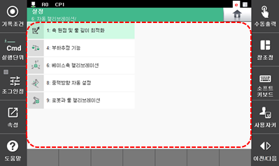

# 7.7 자동 캘리브레이션

올바른 로봇 사용을 위해 교시된 프로그램 및 자동으로 동작하는 움직임을 이용하여 로봇의 축 원점, 툴 길이, 부하 질량, 베이스축 방향을 찾을 수 있습니다. 이렇게 캘리브레이션된 값은 로봇에 자동으로 반영됩니다.

1.	\[6: 자동 캘리브레이션\] 메뉴를 터치하십시오. 자동 캘리브레이션 메뉴가 나타납니다.

2.	원하는 메뉴를 선택하여 로봇의 축 원점, 툴 길이, 부하 질량, 베이스축 방향 등의 캘리브레이션을 수행하십시오.

