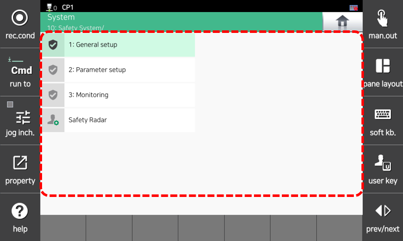

# 7.8 Safety System 


This function is supported from the Hi7 controller.


1.	Touch the `[8: Safety System]` menu. Then, the menu of safety system will appear.

2.	Select the desired menu to perform Basic Settings, Parameter Settings, Monitoring, Certificate, or Safety Radar.


For detailed information on 1: Basic Settings, 2: Parameter Settings, 3: Monitoring, and 4: Certificate of the Safety System, refer to the "[SafeSpace2.0 Manual](https://hrbook-hrc.web.app/#/view/doc-safespace2.0/en/README)".



For detailed information on the Safety Radar, refer to the "[Object Detection System](https://github.com/hyundai-robotics/doc-Object-Detection-System)".
