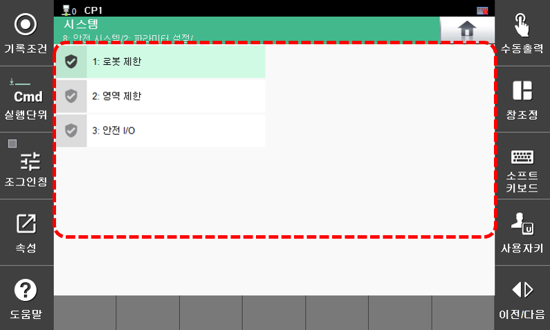

# 7.8.2 파라미터 설정

로봇 안전 파라미터는 안전 기능을 모니터링하기 위한 한계값 및 정지 방법으로 구성됩니다.

각 안전 기능은 활성화 조건과 위반 시 정지 방법, 한계값으로 다양한 구성을 저장하여 활용할 수 있습니다.

안전기능의 기본 설정 메뉴는 아래의 방법으로 진입하십시오.

* **\[시스템 > 8: 안전 시스템 > 2: 파라미터 설정\]** 


파라미터 설정에 대한 자세한 관한 내용은  "[SafeSpace2.0 설명서 3.3 안전기능](https://hrbook-hrc.web.app/#/view/doc-safespace2.0/korean/3-safety-function/3-safety-function/README)"의 3.3.2 로봇 감시 기능, 3.3.3 영역 감시 기능, 3.3.4 안전 신호 입출력을 참고하십시오.


