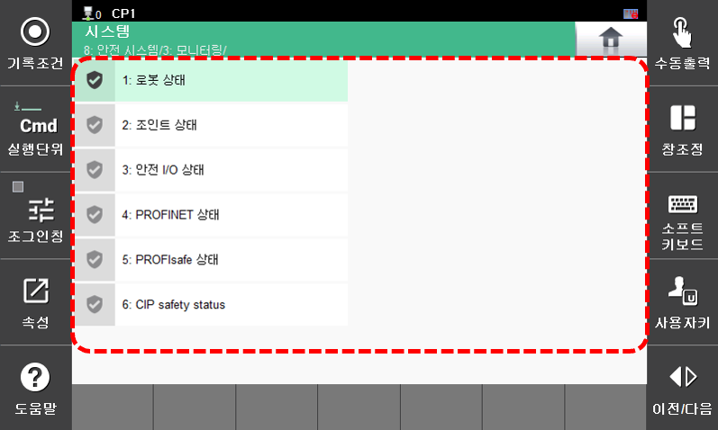

# 7.8.3 모니터링

안전 기능 위반 및 안전 제어 모듈(SCM: Safety Control Module) 보드의 상태를 모니터링합니다. 로봇 감시 기능의 상태와 안전 입출력 상태정보를 확인할 수 있습니다.

모니터링 메뉴는 아래의 방법으로 진입하십시오.

* **\[시스템 > 8: 안전 시스템 > 3: 모니터링\]** 


모니터링에 대한 자세한 관한 내용은  "[SafeSpace2.0 설명서 5. 안전 상태 모니터링](https://hrbook-hrc.web.app/#/view/doc-safespace2.0/korean/5-monitoring/README)"을 참고하십시오.

