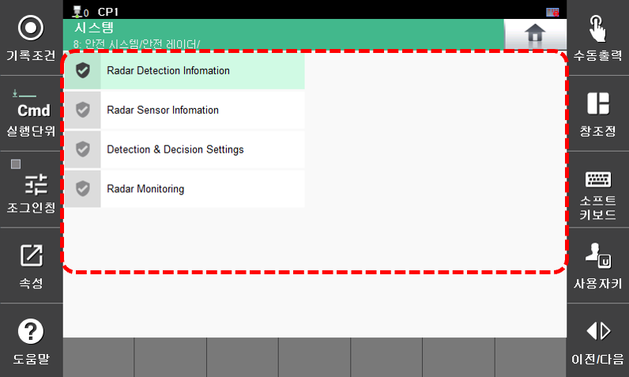

# 7.8.5 안전 레이더

안전 레이더 기능에 대한 메뉴가 표시됩니다.

레이더 메뉴는 아래의 방법으로 진입하십시오.

* **\[시스템 > 8: 안전 시스템 > 안전 레이더\]** 


안전 레이더에 대한 자세한 관한 내용은  "[레이더 사용 설명서](https://github.com/hyundai-robotics/doc-Object-Detection-System)"을 참고하십시오.

