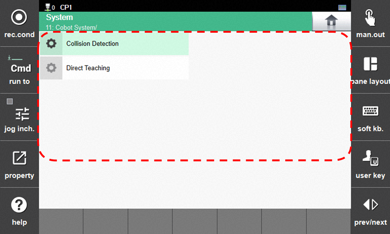



# 7.9 Cobot System


This function is supported from the Hi7 controller.


1.	Touch `[Cobot System]`. The Collaborative Robot System menu appears.

2.	 Select the desired menu to perform Collision Detection or Direct Teaching.


For detailed information on the Collaborative Robot System, refer to the  "[Safety Function Manual for Collaborative Robot](https://hrbook-hrc.web.app/#/view/doc-cobot-safety-function/en/README)".
