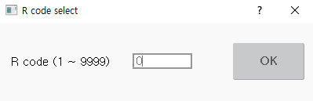

# 8.1 Use of R Codes

The method to execute a specified function using an R code is as follows.

1.	Press the \[R..\] button on the right side of the Hi6 teach pendant screen. Then, the pop-up window for R-code will appear.

2.	Input the code number in the input area, and then touch the \[OK\] button or press the &lt;enter&gt; key. Then, the function designated to the selected R code will be executed.

