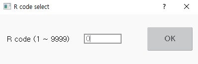

# 8.1 Use of R Codes

The method to execute a specified function using an R code is as follows.

1.	Press the <<b>R..[NO]</b>> key  of the the keypad. Then, the pop-up window for R-code will appear.

    

2.	Input the code number in the input area, and then touch the \[OK\] button or press the <<b>ENTER</b>> key. Then, the function designated to the selected R code will be executed.

    

<table style="text-align:left">
  <thead>
    <tr>
      <th>R Code</th>
      <th>Description</th>
    </tr>
  </thead>
  <tbody>
    <tr>
      <td>R0 : Reset task</td>
      <td>Initialize the step counter and move to STEP0.</td>
    </tr>
    <tr>
      <td>R1 : Reset error</td>
      <td>Clears the status when an error or warning occurs.</td>
    </tr>
    <tr>
      <td>R17 : Open file manager</td>
      <td>Quickly launch [Service] -> [5: File manager]</td>
    </tr>
    <tr>
      <td>R86 : Display free memory</td>
      <td> Used to display the remaining memory of the T/P or motherboard at the top of the T/P screen.</td>
    </tr>
    <tr>
      <td>R99 : Save</td>
      <td>Saves historical data existing in memory as a file.</td>
    </tr>
    <tr>
      <td>R115 : Copy job file</td>
      <td>Copy the created job program to another job program.</td>
    </tr>
    <tr>
      <td>R117 : Delete job file</td>
      <td>This is a function to individually delete written job.</td>
    </tr>
    <tr>
      <td>R286 : Display software version</td>
      <td>Quickly launch [Service] -> [7: System diagnosis] -> [1: System version]</td>
    </tr>
    <tr>
      <td>R321 : Axis sync. jog setting</td>
      <td>Displays a settings screen to group arbitrary axes into one synchronization group and use the function to jog with a single jog key.</td>
    </tr>
    <tr>
      <td>R360 : Set contpath manually</td>
      <td>This is a function that forcibly changes the execution status of CONTPATH.</td>
    </tr>
    <tr>
      <td>R361 : Set jog-inching level</td>
      <td>Use this when you want to change the inching distance of the currently set level.</td>
    </tr>
    <tr>
      <td>R362 : Axis control status change</td>
      <td>Manually execute the control status (axisctrl on/off) of the auxiliary axis.</td>
    </tr>
  </tbody>
</table>

