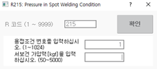

# 8.10 R215 스폿용접조건 가압력 설정

서보건 용접 시 필요한 가압력을 용접 조건 테이블에 설정합니다. \[**시스템** &gt; 4: 응용파라미터 &gt; 1: 스폿용접 &gt; 4: 용접데이터 \(조건, 시퀀스\) &gt; 2: 용접조건\] 메뉴에서도 가압력을 설정할 수 있습니다.

1.	즐겨찾기 창에서 215를 입력한 후 \[확인\] 버튼을 터치하거나 <<b>ENTER</b>> 키를 누르십시오.

2.	용접조건 번호를 입력한 후 \[확인\] 버튼을 터치하거나 <<b>ENTER</b>> 키를 누르십시오.

3.	서보건 가압력을 입력한 후 \[확인\] 버튼을 터치하거나 <<b>ENTER</b>> 키를 누르십시오.

