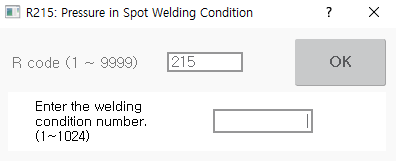
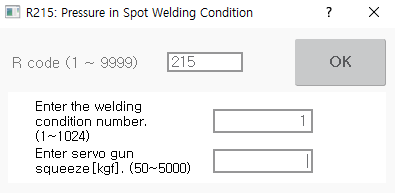

# 8.10 R215 在点焊条件中设置夹紧力

您可以在焊接条件表中设置伺服枪焊接所需的夹紧力。您也可以在`系统 - 4: 应用参数 - 1: 点焊 - 4: 焊接数据 (条件, 顺序) - 2: 焊接条件 (系统 - 4: 应用参数 - 1: 点焊 - 4: 焊接数据 (条件, 顺序) - 2: 焊接条件)`菜单中设置夹紧力。

1. 输入215后，触摸`[OK]`按钮或按下`[ENTER]`键。

2. 输入焊接条件编号后，触摸`[OK]`按钮或按下`[ENTER]`键。

    

3. 输入伺服枪夹紧力后，触摸`[OK]`按钮或按下`[ENTER]`键。

    