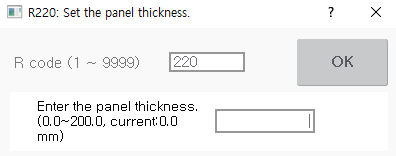

# 8.11 R220 设定面板厚度 \(Sv\)

您可以手动设定面板厚度，以记录伺服枪点焊步骤。

如果您执行一键记录，其中 MOVE 和 SPOT 指令在伺服枪固定电极仅与面板接触的状态下同时被记录，则移动电极的位置将根据面板厚度和磨损量自动记录在 MOVE 指令中。

1. 在收藏窗口输入 220 后，触摸 `[OK]` 按钮或按 `[ENTER]` 键。

2. 在输入面板厚度后，触摸 `[OK]` 按钮或按 `[ENTER]` 键。

    


有关面板厚度手动设置的详细信息，请参阅 "[${cont_model} 控制器点焊功能手册](https://hrbook-hrc.web.app/#/view/doc-spot-weld/zh/README)"。
