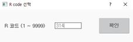

# 8.12 R314 엔지니어 모드

R 코드 창에서 314을 입력한 후 [__확인__] 버튼을 터치하거나 <__ENTER__> 키를 누르십시오.

완료 후 화면 우측 상단에 아래와 같은 표시가 깜빡입니다.

엔지니어 모드에서는 다음과 같은 기능의 설정이 가능합니다.

* 축 원점 (로봇 파라미터) 
* 소프트 리밋 (로봇 파라미터) 
* 엔코더 옵셋 (로봇 파라미터) 
* 서보 파라미터 (로봇 파라미터) 
* 가감속 파라미터 (로봇 파라미터) 
* 조그인칭 레벨 설정 (로봇 파라미터)
* 서보툴 체인지 (응용 파라미터) 
* 시스템 초기화 (초기화)
* 로봇타입 선택 (초기화)
* 부가축 파라미터 설정 (초기화)
* 축 잠금 설정 (초기화)
* 기타 세부 응용 기능



* 엔지니어 모드에서 잘못 설정하면 로봇 시스템에 심각한 문제가 발생할 수 있으므로 주의하시기 바랍니다. 

