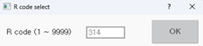

# 8.12 R314工程模式

在R代码窗口中，输入314，然后触摸`[OK]`按钮或按`[ENTER]`键。

完成后，以下显示会在屏幕的右上角闪烁。

在工程模式中可以设置以下功能。

* 轴原点（机器人参数）  
* 软极限（机器人参数）  
* 编码器偏移（机器人参数）  
* 伺服参数（机器人参数）  
* 加速和减速参数（机器人参数）  
* 伺服工具更换（应用参数）  
* 系统初始化（初始化）  
* 机器人类型选择（初始化）  
* 额外轴参数（初始化）  
* 轴锁定（初始化）  
* 其他详细应用  



* 请注意，在工程模式中的不正确设置可能会导致机器人系统出现严重问题。