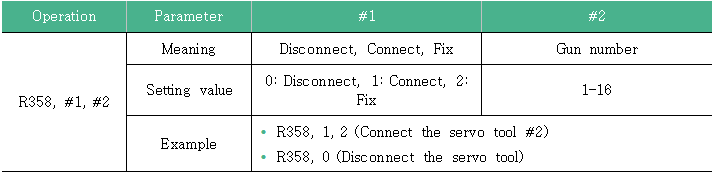
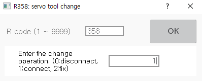
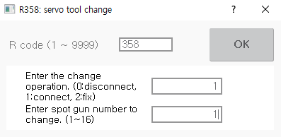

# 8.13 R358 for Changing the Servo Tool

You can manually connect and disconnect the servo tool in the servo tool change system. 

To change the servo tool in the servo tool change system, you need to disconnect or connect the power and various signal lines using a physical automatic tool change \(ATC\) device.

When the servo tool is a servo gun, if you want to manually perform the change work, you need to move the robot, while the motor is turned on, to the servo gun support table where you can connect or disconnect the robot, and then perform the change work. If the servo tool is a different type, such as a positioner, you can perform the change work when the preparation for connection and disconnection work is completed.

R358 servo tool change parameters and the examples are as follows.

The method to change the servo tool using the R358 code is as follows.

1.	After inputting 358 in the favorites window, touch the \[OK\] button or press the <<b>ENTER</b>> key.

2.	After inputting the change operation number \(0: Disconnect, 1: Connect, 2: Fix\), touch the \[OK\] button or press the <<b>ENTER</b>> key.

    

3.	After inputting the number of the welding gun to change, touch the \[OK\] button or press the <<b>ENTER</b>> key. The selected weld gun number will be displayed on the \[Gun\] button on the left side of the Hi6 teach pendant screen.

    


* R358 code cannot be used in automatic mode. It must be used in manual mode.
* 
  When the spot gun number is changed, the tool number designated in the spot gun corresponding tool number will be automatically changed. You can check the spot gun corresponding tool number in the \[system &gt; 4: Application Parameter &gt; 1: Spot Welding &gt; 1: Gun Number Corresponding Tool Number and Gun Type Setting\] menu.

* 
  The servo tool change setting can be performed only when the motor is turned on.

* For details on the servo tool change, refer to the “[Hi6 Controller Spot Welding Function Manual](https://hrbook-hrc.web.app/#/view/doc-spot-weld/english/README)”.


