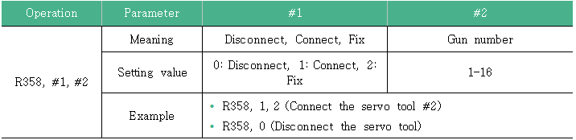
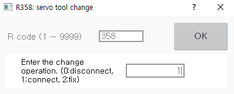
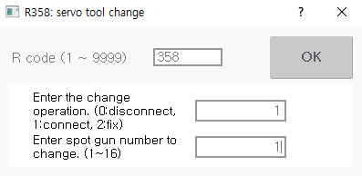

# 8.13 R358 更改伺服工具

您可以手动连接和断开伺服工具在伺服工具更换系统中。

要在伺服工具更换系统中更换伺服工具，您需要使用物理自动工具更换 \(ATC\) 设备断开或连接电源和各种信号线。

当伺服工具是伺服枪时，如果您想手动进行更换工作，您需要在电机开启的情况下移动机器人到可以连接或断开机器人的伺服枪支撑桌，然后进行更换工作。如果伺服工具是其他类型，例如定位器，您可以在连接和断开工作准备完成后进行更换工作。

R358 伺服工具更换参数及示例如下。

使用 R358 代码更换伺服工具的方法如下。

1. 在收藏夹窗口输入358后，触摸 `[OK]` 按钮或按 `[ENTER]` 键。

2. 输入更换操作编号 \(0: 断开, 1: 连接, 2: 固定\) 后，触摸 `[OK]` 按钮或按 `[ENTER]` 键。

    

3. 输入要更换的焊接枪编号后，触摸 `[OK]` 按钮或按 `[ENTER]` 键。所选的焊接枪编号将在 ${cont_model} 教导挂架屏幕的右下角显示。

    


* R358 代码不能在自动模式下使用。必须在手动模式下使用。
* 
  当点焊枪编号更改时，对应点焊枪指定的工具编号将自动更改。您可以在 `[system - 4: Application Parameter - 1: Spot Welding - 2:Welding gun parameter] ([system  - 4: Application Parameter  - 1: Spot Welding  - 2:Welding gun parameter])` 菜单中查看对应点焊枪的工具编号。

* 
  伺服工具更换设置只能在电机开启时进行。

* 有关伺服工具更换的详细信息，请参阅 "[${cont_model} 控制器点焊功能手册](https://hrbook-hrc.web.app/#/view/doc-spot-weld/zh/README)"。
