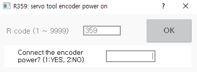

# 8.13 R359 for Servo Tool Encoder Power On Relay

If the servo gun is applied in the servo tool change system, you need to execute this function to reset the encoder of the servo tool axis when installing the servo tool for the first time.

1.	After inputting 359 in the favorites window, touch the \[OK\] button or press the <<b>ENTER</b>> key.

2.	After inputting 1, touch the \[OK\] button or press the <<b>ENTER</b>> key. Then, the power will be supplied to the encoder.

    


* R359 code cannot be used in automatic mode. It must be used in manual mode.
* 
  To disable the forced power supply to the servo gun encoder, you should turn off the power of the controller and then turn it back on. Therefore, when the encoder reset is completed, turn off the power of the controller and turn it back on, and then progress the manual connection.

* The servo tool encoder power setting function is a function for engineers, so it is not supported for general users. Please contact our engineer for more information on this feature.
* For details on the servo tool encoder power setting, refer to the “[Hi6 Controller Spot Welding Function Manual](https://hrbook-hrc.web.app/#/view/doc-spot-weld/english/README)”.



Never mechanically connect or disconnect the servo gun while the encoder power is forcibly supplied.


