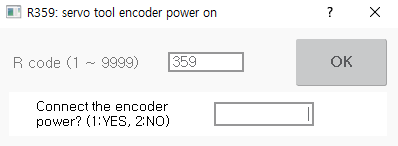

# 8.14 R359用于伺服工具编码器电源开启继电器

如果伺服枪在伺服工具更换系统中应用，当第一次安装伺服工具时，您需要执行此功能以重置伺服工具轴的编码器。

1. 在收藏夹窗口中输入359后，触摸`[OK]`按钮或按`[ENTER]`键。

2. 在输入1后，触摸`[OK]`按钮或按`[ENTER]`键。然后，电源将供应给编码器。

    


* R359代码无法在自动模式下使用。必须在手动模式下使用。
* 
  要禁用伺服枪编码器的强制电源供应，您应该关闭控制器的电源，然后再重新开启。因此，当编码器重置完成后，请关闭控制器的电源并重新开启，然后进行手动连接。

* 伺服工具编码器电源设置功能是为工程师设计的，因此不支持一般用户。有关此功能的更多信息，请联系我们的工程师。
* 有关伺服工具编码器电源设置的详细信息，请参阅“[${cont_model} 控制器点焊功能手册](https://hrbook-hrc.web.app/#/view/doc-spot-weld/zh/README)”。



在强制供应编码器电源时，切勿机械连接或断开伺服枪。
