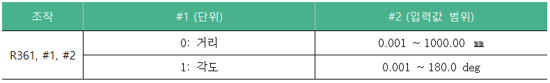
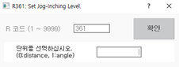
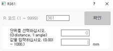

# 8.14 R361 조그인칭 레벨 설정

R361 조그인칭 레벨 설정 정보는 다음과 같습니다.

현재 설정된 레벨의 인칭 거리를 변경하는 방법은 다음과 같습니다.

1.	즐겨찾기 창에서 361을 입력한 후 \[확인\] 버튼을 터치하거나 &lt;enter&gt; 키를 누르십시오.

2.	조그인칭 레벨의 단위\(0: 거리, 1: 각도\)를 입력한 후 \[확인\] 버튼을 터치하거나 &lt;enter&gt; 키를 누르십시오.

3.	1을 입력한 경우, 인칭 각도를 입력한 후 \[확인\] 버튼을 터치하거나 &lt;enter&gt; 키를 누르십시오.


* 자동 모드에서는 R361 코드를 사용할 수 없습니다. 반드시 수동 모드에서 사용하십시오.
* R361 코드를 이용해 설정한 인칭 거리는 현재 설정되어 있는 조그레벨에 대해 설정됩니다. 따라서 현재 조그속도 레벨이 8인 경우, 8i에 해당하는 인칭 거리가 변경됩니다.
* 조그인칭 키가 활성화\(LED On\)된 상태에서만 조그인칭 동작이 가능합니다.
* 조그인칭 레벨 설정 기능은 일반 사용자에게 지원되지 않는 엔지니어용 기능입니다. 이 기능에 대한 자세한 내용은 엔지니어에게 문의하시기 바랍니다.


