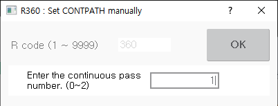

# 8.15 R360 手动设置 CONTPATH

它手动更改 CONTPATH（连续路径）模式。输入范围为 0, 1 和 2，每个数字的描述如下。（与 [5.7 contpath](https://hrbook-hrc.web.app/#/view/doc-hrscript/zh/5-moving-robot/7-contpath?cont_model=${cont_model}) 声明相同。）

<table>
  <thead>
    <tr>
      <th style="text-align:left">编号</th>
		<th style="text-align:left">含义</th>
      <th style="text-align:left">描述</th>
    </tr>
  </thead>
  <tbody>
    <tr>
      <td>0</td>
		<td>不连续</td>
      <td style="text-align:left">
        如果步骤包含功能，当到达步骤位置时，机器人暂停时执行功能，然后移动到下一个步骤。
      </td>
	 </tr>
	 <tr>
		<td>1</td>
		<td>连续。 但是，输入信号是不连续的（默认）</td>
      <td style="text-align:left">
        在步骤运动期间，当机器人移动时，目标步骤中的功能被执行，然后通过目标步骤移动到下一个步骤。 
		但是，在输出功能的情况下，实际输出点在命令值达到准确范围内时输出。 
		此外，如果输入信号用于命令的参数，当机器人暂停时执行功能，然后移动到下一个步骤。
      </td>
	 </tr>
	 <tr>
		<td>2</td>
		<td>连续。 输入信号也是连续的</td>
      <td style="text-align:left">
        即使命令包含输入信号，它也会预先被解释并连续移动。
      </td>
      <td style="text-align:left"></td>
    </tr>
  </tbody>
</table>

 
 



- 输入信号 : fb.di

- 输出信号 : fb.do, _s, _m, _mo,

- 其他不连续条件
  1) 在不连续条件下的不连续操作：步骤 FWD，步骤 BWD，一步回放
  2) GUN1 或 GUN2 步骤。
  3) 如果 accu=0 且值为 0
  4) 如果工具编号改变



操作方法如下：

1. 按下 R 按钮，输入 360，触摸 `[OK]` 按钮，或按 <b>ENTER</b> 键。

2. 输入连续通过编号（0~2），触摸 `[OK]` 按钮，或按 <b>ENTER</b> 键。

3. 可以通过标题栏中的 `CP0`、`CP1` 或 `CP2` 标志检查更改的模式。

