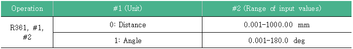
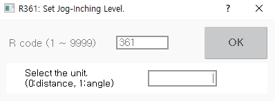
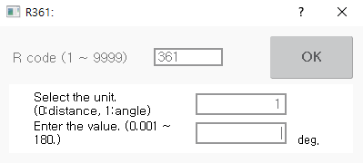

# 8.16 R361 for Setting the Jog Inching Level

R361 jog inching level setting information is as follows.

The method to change the inching distance of the currently set level is as follows.

1.	After inputting 361 in the favorites window, touch the \[OK\] button or press the <<b>ENTER</b>> key.

2.	After inputting the unit of the jog inching level \(0: Distance. 1: Angle\), touch the \[OK\] button or press the <<b>ENTER</b>> key.

    

3.	If you input '1', input a inching angle and touch the \[OK\] button or press the <<b>ENTER</b>> key.

    


* R361 code cannot be used in automatic mode. It must be used in manual mode.
* The inching distance set using the R361 code will be set for the currently set jog level. Therefore, if the current jog speed level is 8, the inching distance corresponding to 8 will be changed.
* Jog inching is possible only when the jog inching key is activated \(LED On\).


