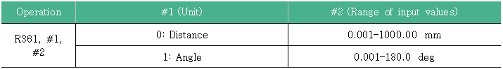
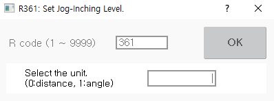
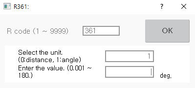

# 8.16 R361 设置 Jog 进给级别

R361 jog 进给级别设置信息如下。

更改当前设置级别的进给距离的方法如下。

1. 在收藏窗口中输入 361 后，触摸 `[OK]` 按钮或按 `[ENTER]` 键。

2. 输入 jog 进给级别的单位 \(0: 距离. 1: 角度\)，然后触摸 `[OK]` 按钮或按 `[ENTER]` 键。

    

3. 如果输入 '1'，请输入进给角度，然后触摸 `[OK]` 按钮或按 `[ENTER]` 键。

    


* R361 代码不能在自动模式下使用。必须在手动模式下使用。
* 使用 R361 代码设置的进给距离将用于当前设置的 jog 级别。因此，如果当前 jog 速度级别为 8，则将更改与 8 对应的进给距离。
* 仅当激活 jog 进给键 \(LED 开\) 时，才能进行 jog 进给。
