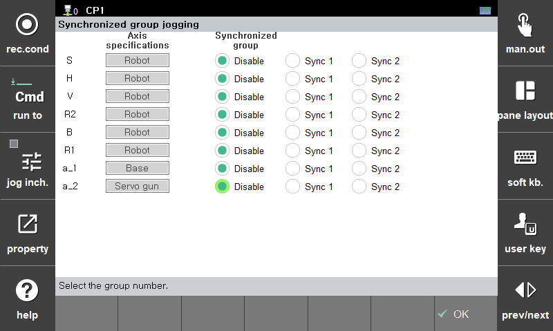

# 8.17 R321 轴同步 jog 设置

这是一个将任意轴分组到一个同步组并用单个 jog 按键进行 jog 的功能。

使用轴同步 jog 功能的方法如下。

1. 将您希望通过一个按键移动的轴设置到同一同步组，然后按下 `[OK]` 按钮。
2. 使用 jog 按键进行轴同步 jog。
3. 当您完成使用轴同步 jog 功能时，将所有同步组设置为无效。


* 此功能仅在 jog 时有效。同步功能不适用于自动模式。
* 同步 jog 配对在重启时不会初始化。
* 同步 jog 配对在笛卡尔坐标系中的姿态值与实际机器人的姿态情况不匹配（简单 jog 功能）。
