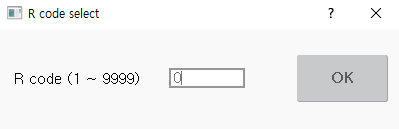

# 8.2 R0 for Resetting the Step Counter

After inputting 0 in the favorites window, touch the \[OK\] button or press the <<b>ENTER</b>> key.

You can initialize the step counter to move to STEP0. You can also perform the following functions.

* Clearing the playback execution status
* Turning off the overall abnormality signal and lamp
* Turning off the alarm signal
* Clearing the wait status
* Clearing the status and signals of various application functions


R0 code cannot be used during the startup of the robot.


