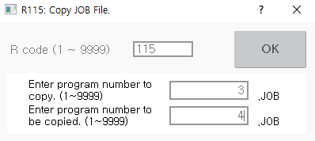

# 8.3 R115 复制程序

您可以将主板上的 JOB 程序复制到主板上的另一个程序。在输入要复制的程序编号后，输入要将复制的程序复制到的程序编号。

1. 在收藏窗口输入 115 后，触摸 `[OK]` 按钮或按 `[ENTER]` 键。

2. 在输入您要复制的程序 \(原始\) 的编号以及您要将复制的程序复制到的程序 \(目标\) 的编号后，触摸 `[OK]` 按钮或按 `[ENTER]` 键。然后，程序将被复制。

    

* 如果要将复制的程序复制到的程序已经存在相同编号的程序，您需要选择是否覆盖该文件。
* 
  如果没有原始文件可供复制，将会出现通知消息 \("没有原始文件存在."\)。


代码 R115 在程序运行时无法使用；必须在程序停止时使用。
