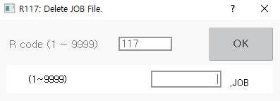

# 8.4 R117 删除程序

您可以单独删除内部存储器中的程序。

1. 在收藏夹窗口输入117后，触摸`[OK]`按钮或按`[ENTER]`键。

2. 输入您想要删除的程序编号后，触摸`[OK]`按钮或按`[ENTER]`键。然后，删除确认窗口将出现。

    

* 如果没有文件可以删除，将出现通知消息（"没有文件存在。"）。
* 如果您想删除被保护的程序，将出现通知消息（"受保护的文件。"）。

3. 在删除确认窗口中，触摸`[OK]`按钮或按`[ENTER]`键。然后，选定的程序将被删除。


R117代码无法在自动模式下使用。必须在手动模式下使用。
