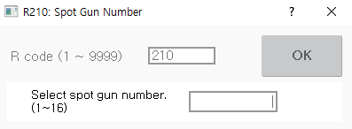

# 8.5 R210 for Selecting a Spot Gun Number

You can select the spot guns to use when using multiple spot welding guns \(servo guns or pneumatic guns\).

1.	After inputting 210 in the favorites window, touch the \[OK\] button or press the <<b>ENTER</b>> key.

2.	After inputting the number of the spot gun to use, touch the \[OK\] button or press the <<b>ENTER</b>> key.

    

* The selected spot gun number will be displayed on the \[Gun\] button on the left side of the Hi6 teach pendant screen.
* If you change the spot gun number, the tool number designated in the spot gun corresponding tool number will be automatically changed. You can check the spot gun corresponding tool number in the \[system &gt; 4: Application Parameter &gt; 1: Spot Welding &gt; 1: Gun Number Corresponding Tool Number and Gun Type Setting\] menu.


* R210 code cannot be used during the startup of the robot.
* The spot gun number can be set only in the spot welding environment \(\[Spot Welding\] item in the \[system &gt; 5: Initialize&gt; 3: Usage Setting\] menu is set as enable\).
* You can manually open, close, and squeeze the selected spot welding gun. For details on the spot welding function, refer to the “Hi6 Controller Spot Welding Function Manual.”


