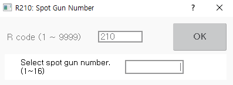

# 8.5 R210 选择点焊枪编号

在使用多个点焊枪（伺服枪或气动枪）时，您可以选择要使用的点焊枪。

1. 在收藏窗口中输入210后，触摸`[OK]`按钮或按`[ENTER]`键。

2. 输入要使用的点焊枪编号后，触摸`[OK]`按钮或按`[ENTER]`键。

    

* 选定的点焊枪编号将在${cont_model}示教器屏幕的右下角显示。
* 如果更改点焊枪编号，则相应的工具编号将自动更改。您可以在`[system - 4: Application Parameter - 1: Spot Welding - 2:Welding gun parameter] ([system  - 4: Application Parameter  - 1: Spot Welding  - 2:Welding gun parameter])`菜单中检查相应的点焊枪工具编号。


* R210代码在机器人启动期间无法使用。
* 只有在点焊环境中才能设置点焊枪编号（`[system - 5: 初始化 - 3: Usage Setting] ([system  - 5: Initialize - 3: Usage Setting])`菜单中的`[Spot Welding]`项设置为启用）。
* 您可以手动打开、关闭和挤压选定的点焊枪。有关点焊功能的详细信息，请参阅"${cont_model} Controller Spot Welding Function Manual."
