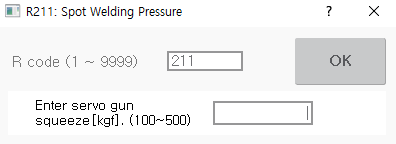

# 8.6 R211 for Setting the Servo Gun Squeeze Force

You can manually set the squeeze force when executing the servo gun squeeze. 

1.	After inputting 211 in the favorites window, touch the \[OK\] button or press the <<b>ENTER</b>> key.

2.	After inputting the squeeze force, touch the \[OK\] button or press the <<b>ENTER</b>> key.

    

* The squeeze force in the welding condition file will not be changed.
* If the inputted squeeze force is greater than or smaller than the upper limit of the current/pressure table of the servo gun parameters, a warning message will appear.


* R211 code cannot be used during the startup of the robot. 
* 
  The spot gun number can be set only in the spot welding environment \(\[Spot Welding\] item in the \[system &gt; 5: Initialize&gt; 3: Usage Setting\] menu is set as enable\). 

* For details on the manual setting of the servo gun squeeze force, refer to the “Hi6 Controller Spot Welding Function Manual.”


