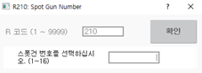

# 8.6 R211 서보건 가압력 설정

서보건 가압 실행 시 가압력을 수동으로 설정합니다.

1.	즐겨찾기 창에서 211을 입력한 후 \[확인\] 버튼을 터치하거나 &lt;enter&gt; 키를 누르십시오.

2.	서보건 가압력을 입력한 후 \[확인\] 버튼을 터치하거나 &lt;enter&gt; 키를 누르십시오.

* 용접 조건 파일의 가압력은 변경되지 않습니다.
* 입력한 가압력이 서보건 파라미터의 전류 가압력 테이블의 상한치보다 크거나 작으면 경고 메시지가 나타납니다.


* 로봇 기동 중에는 R211 코드를 사용할 수 없습니다.
* 스폿 용접 환경\(\[설정 &gt; 5: 초기화 &gt; 3: 용도설정\] 메뉴의 \[스폿용접\] 항목을 유효로 설정\)에서만 스폿건 번호를 설정할 수 있습니다.
* 서보건 가압력 수동 설정에 대한 자세한 내용은 “Hi6제어기 스폿용접 기능 설명서”를 참조하십시오.


