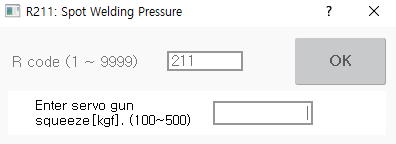

# 8.6 R211 用于设置伺服枪夹紧力

您可以在执行伺服枪夹紧时手动设置夹紧力。

1. 在收藏夹窗口输入211后，触摸`[OK]`按钮或按`[ENTER]`键。

2. 输入夹紧力后，触摸`[OK]`按钮或按`[ENTER]`键。

    

* 焊接条件文件中的夹紧力不会被更改。
* 如果输入的夹紧力大于或小于伺服枪参数的电流/压力表的上限，将显示警告信息。


* R211代码在机器人启动期间无法使用。 
* 
  仅在点焊环境中可以设置点焊枪编号 \(`[Spot Welding]`项目在`[system - 5: 初始化 - 3: Usage Setting] ([system  - 5: Initialize - 3: Usage Setting])`菜单中设置为启用\)。 

* 有关伺服枪夹紧力的手动设置的详细信息，请参阅"[${cont_model} Controller Spot Welding Function Manual](https://hrbook-hrc.web.app/#/view/doc-spot-weld/zh/README)"。
