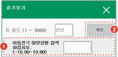

# 8.7 R212 서보건 이동전극 마모량 프리셋

서보건 이동전극의 마모량을 수동으로 설정합니다.

1.	즐겨찾기 창에서 212를 입력한 후 \[확인\] 버튼을 터치하거나 &lt;enter&gt; 키를 누르십시오.

2.	이동전극의 마모량을 입력한 후 \[확인\] 버튼을 터치하거나 &lt;enter&gt; 키를 누르십시오.


설정값을 전극의 실마모량 보다 크거나 작게 설정하면 가압력 불일치나 작업물 간섭 등을 유발할 수 있으므로 주의하십시오.



* 로봇 기동 중에는 R212 코드를 사용할 수 없습니다.
* 스폿 용접 환경\(\[설정 &gt; 5: 초기화 &gt; 3: 용도설정\] 메뉴의 \[스폿용접\] 항목을 유효로 설정\)에서만 스폿건 번호를 설정할 수 있습니다.
* 서보건 이동전극의 마모량 수동 설정에 대한 자세한 내용은 “Hi6제어기 스폿용접 기능 설명서”를 참조하십시오.


