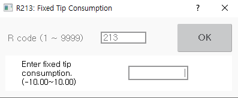

# 8.8 R213 用于预设伺服枪固定电极磨损量

您可以手动设置伺服枪固定电极磨损量。

1. 在收藏窗口中输入213后，触摸`[OK]`按钮或按`[ENTER]`键。

2. 输入固定电极磨损量后，触摸`[OK]`按钮或按`[ENTER]`键。

    


请注意，如果设置的值大于或小于电极的实际磨损量，可能会导致夹紧力不匹配或与工件干涉。



* R213代码在机器人启动期间无法使用。
* 点焊枪编号仅可在点焊环境中设置 \(`[Spot Welding]` 项在 `[system - 5: 初始化 - 3: Usage Setting] ([system  - 5: Initialize - 3: Usage Setting])` 菜单中设置为启用\)。
* 有关伺服枪固定电极磨损量的手动设置的详细信息，请参阅 "[${cont_model} 控制器点焊功能手册](https://hrbook-hrc.web.app/#/view/doc-spot-weld/zh/README)"。
