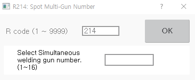

# 8.9 R214 for Selecting Welding Guns Simultaneously

You can select the numbers of spot welding guns \(servo guns or pneumatic guns\) that are to be used in a welding operation in which multiple spot welding guns will be used at the same time.

1.	After inputting 214 in the favorites window, touch the \[OK\] button or press the &lt;enter&gt; key. 

2.	After inputting the numbers of the welding guns to use simultaneously, touch the \[OK\] button or press the &lt;enter&gt; key.

* The selected spot gun number will be displayed on the \[Gun\] button on the left side of the Hi6 teach pendant screen.
* If you select spot welding guns that are different in type from each other, a notification message \(“The Gun Type of the Currently Selected Gun is Set Incorrectly.”\) will appear.


* R214 code cannot be used during the startup of the robot.
* The spot gun number can only be set in the spot welding environment \(\[Spot Welding\] item in the \[Set Up &gt; 5: Initialize &gt; 3: Usage Setting\] menu is set as enable.
* You can check the setting status of the spot welding gun in the \[Set Up &gt; 4: Application Parameter &gt; 1: Spot Welding &gt; 1: Gun Number Corresponding Tool Number and Gun Type Setting\] menu.
  * When a gun is selected as a multisync gun, the manual squeeze/open/close operations of the selected gun will be simultaneously in sync with the previously selected guns.
  * When a gun is selected as a multisync gun, if the gun LED is in the ON status, the SPOT command will be recorded in the sync spot format.
* The selected spot welding gun can be operated manually. For details on the spot welding function, refer to the “Hi6 Controller Spot Welding Function Manual.”


