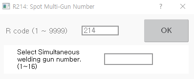

# 8.9 R214 同时选择焊接枪

您可以选择在焊接操作中将同时使用的点焊枪（伺服枪或气动枪）的数量。

1. 在收藏夹窗口输入 214 后，触摸 `[OK]` 按钮或按 `[ENTER]` 键。

2. 输入要同时使用的焊接枪的数量后，触摸 `[OK]` 按钮或按 `[ENTER]` 键。

    

* 所选的点枪号码会显示在 ${cont_model} 教学挂件屏幕的右下角。
* 如果您选择的点焊枪类型不同，将出现通知消息（“当前选择的枪的类型设置不正确。”）。

 


* R214 代码在机器人启动期间不能使用。
* 点枪号码只能在点焊环境中设置（`[Spot Welding]` 项在 `[system - 5: 初始化 - 3: Usage Setting] ([system  - 5: Initialize  - 3: Usage Setting])` 菜单中设置为启用）。
* 您可以在 `[system - 4: Application Parameter - 1: Spot Welding - 2:Welding gun parameter] ([system  - 4: Application Parameter  - 1: Spot Welding  - 2:Welding gun parameter])` 菜单中检查点焊枪的设置状态。
  * 当枪被选为多同步枪时，所选择枪的手动挤压/打开/关闭操作将与之前选择的枪同步进行。
  * 当枪被选为多同步枪时，如果枪 LED 处于打开状态，SPOT 命令将以同步点格式记录。
* 所选的点焊枪可以手动操作。有关点焊功能的详细信息，请参考 "[${cont_model} 控制器点焊功能手册](https://hrbook-hrc.web.app/#/view/doc-spot-weld/zh/README)"。
