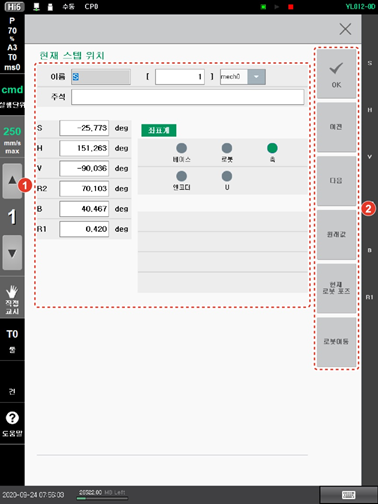

# 9.2.1 숨은 포즈 move문

숨은 포즈 move문\(\[기록\] 버튼으로 기록된 스텝, 즉 포즈 변수를 포함하지 않는 move문\)에서 현재 스텝의 위치를 확인하거나 수정합니다.

1. 숨은 포즈로 기록된 이동 명령\(move문\)에서 \[속성\] 버튼을 터치하십시오. 현재 스텝의 위치가 나타납니다.
2. 현재 스텝의 위치를 확인하고 수정하십시오.

<table>
  <thead>
    <tr>
      <th style="text-align:left">번호</th>
      <th style="text-align:left">설명</th>
    </tr>
  </thead>
  <tbody>
    <tr>
      <td style="text-align:left">
        
      </td>
      <td style="text-align:left">
        
현재 스텝의 위치 정보입니다.
          이름과 좌표값, 좌표계
          형식 등을 확인하고 설정할
          수 있습니다.

        <ul>
          <li>[이름]: 현재 스텝의 번호입니다.
            스텝 번호를 입력한 후
            &lt;enter&gt; 키를 누르면 해당
            스텝으로 이동합니다.</li>
          <li>좌표값: 현재 스텝의 좌표값입니다.</li>
          <li>커서키를 이용해 항목을
            선택합니다.</li>
          <li>원하는 항목에서 값을
            입력한 후 &lt;enter&gt; 키를 눌러
            변경 내용을 반영합니다.</li>
          <li>좌표계 형식이 엔코더로
            설정된 경우에는 좌표값이
            변경되지 않습니다.</li>
          <li>[좌표계]: 현재 스텝의
            위치를 표현할 좌표계
            형식입니다.</li>
        </ul>
      </td>
    </tr>
    <tr>
      <td style="text-align:left">
        
      </td>
      <td style="text-align:left">
        <ul>
          <li>[OK]: 변경 내용을 저장합니다.</li>
          <li>[이전]/[다음]: 이전 또는
            다음 스텝의 정보를 표시합니다.</li>
          <li>[원래값]: 현재 스텝의
            원래 숨은 포즈값을 표시합니다.</li>
          <li>[현재 로봇 포즈]: 현재
            로봇이 취하고 있는 자세의
            값을 표시합니다.</li>
          <li>[로봇 이동]: [로봇 이동]
            버튼을 터치하여 기록된
            스텝의 위치로 로봇을
            움직입니다. (조그)</li>
        </ul>
      </td>
    </tr>
  </tbody>
</table>

1. \[기록\] 버튼을 터치하십시오. 작업 프로그램에 변경 내용이 저장되고 작업이 종료됩니다.
2. &lt;esc&gt; 키를 눌러 종료하면 변경 내용이 저장되지 않습니다.


* \[로봇 구성 형태\]를 미지정으로 설정하는 경우 로봇은 현재 위치에서 가장 가깝게 로봇 형태를 지정합니다.
* 로봇 구성 형태에 따른 지정은 “[2.3.2.2 베이스 및 로봇 기록 좌표](../../2-operation/3-step/2-step-pose-modify/2-base-robot-crd-sys.md)”를 참조하십시오.


