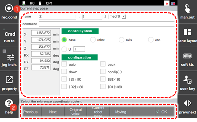

# 9.2.1 隐藏位姿移动语句

您可以检查或修改当前步骤在隐藏位姿移动语句中的位置 \(由 `[REC]` 键记录的步骤，即不包括位姿变量的移动语句\)。

1.	触摸作为隐藏位姿记录的移动命令 \(移动语句\) 中的 `[property]` 按钮。然后，当前步骤位置将显示。

2.	检查并修改当前步骤位置。

    

<table>
  <thead>
    <tr>
      <th style="text-align:left">编号</th>
      <th style="text-align:left">描述</th>
    </tr>
  </thead>
  <tbody>
    <tr>
      <td style="text-align:left">
        
      </td>
      <td style="text-align:left">
        
当前步骤的位置信息。您可以检查并设置名称、坐标值和坐标系统格式等。

        <ul>
          <li><b>[名称]</b>: 当前步骤的编号。输入步骤编号后，按 <b>`[ENTER]` </b>键移动到相关步骤。</li>
          <li><b>坐标值</b>: 当前步骤的当前坐标值
            <ul>
              <li>使用光标键选择项目。</li>
              <li>在所需项目中输入值后，按 `[ENTER]` 键以反映该更改。</li>
              <li>如果坐标系统格式设置为编码器，则坐标值将不会更改。</li>
            </ul>
          </li>
          <li><b>[坐标系]</b>: 表达当前步骤位置的坐标系统格式</li>
        </ul>
      </td>
    </tr>
    <tr>
      <td style="text-align:left">
        
      </td>
      <td style="text-align:left">
        <ul>
          <li>`[OK]`: 您可以保存更改。</li>
          <li><b>[上一页]/[下一页]</b>: 您可以显示上一个或下一个步骤的信息。</li>
          <li><b>[原始值]</b>: 您可以显示当前步骤的原始隐藏位姿值。</li>
          <li><b>[当前机器人位姿]</b>: 您可以显示机器人当前采取的姿态值。</li>
          <li><b>[移动]</b>: 触摸该按钮将使机器人移动到记录的步骤位置 (Jog)。</li>
        </ul>
      </td>
    </tr>
  </tbody>
</table>

3.	触摸 `[OK]` 按钮。然后，更改将保存在作业程序中，操作将结束。 

* 如果您通过按 `[ESC]` 键结束操作，更改将不会被保存。 


* 如果 `[Robot Configuration]` 设置为未指定，机器人将指定最接近当前机器人位置的配置。
* 
  关于机器人配置的指定，请参考 "[2.3.2.2 基座和机器人记录坐标](../../2-operation/3-step/2-step-pose-modify/2-base-robot-crd-sys.md)"。
