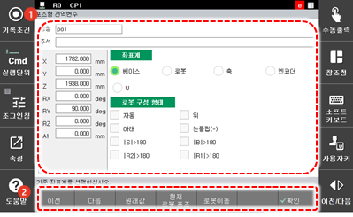

# 9.2.2 포즈기록 move문, 포즈 대입문

포즈 변수를 포함하는 move문 또는 포즈 변수 대입문에서 포즈 변수값을 편집합니다.

1. 포즈 변수로 기록된 이동 명령\(move문\)에서 \[속성\] 버튼을 터치하십시오. 포즈 변수 설정 화면이 나타납니다.
2. 현재 포즈 변수를 확인하고 수정하십시오.

<table>
  <thead>
    <tr>
      <th style="text-align:left">번호</th>
      <th style="text-align:left">설명</th>
    </tr>
  </thead>
  <tbody>
    <tr>
      <td style="text-align:left">
        
      </td>
      <td style="text-align:left">
        
현재 포즈 변수 정보입니다.
          이름과 좌표값, 좌표계
          형식 등을 확인하고 설정할
          수 있습니다.

        <ul>
          <li>[이름]: 현재 포즈 변수의
            이름입니다.</li>
          <li>좌표값: 현재 포즈 변수의
            좌표값입니다.
            <ul>
              <li>커서키를 이용해 항목을
                선택합니다.</li>
              <li>원하는 항목에서 값을
                입력한 후 <<b>ENTER</b>> 키를 눌러
                변경 내용을 반영합니다.</li>
              <li>좌표계 형식이 엔코더로
                설정된 경우에는 좌표값이
                변경되지 않습니다.</li>
            </ul>
          </li>
          <li>[좌표계]: 현재 포즈 변수의
            위치를 표현할 좌표계
            형식입니다.</li>
          <li>[로봇 구성 형태]: 로봇의
            위치를 기술할 때 그 기구의
            특성상 복수의 해가 존재하므로,
            그 형태를 유일하게 기술하기
            위한 로봇 형태(Configuration)를
            지정한 것입니다.
            <ul>
              <li>좌표계 형식이 베이스
                또는 로봇으로 설정된
                경우에만 사용할 수 있습니다.</li>
              <li>로봇 구성 형태에 대한
                자세한 내용은 “<a href="../../operation/step/step-pose-modify/">2.3.2 스텝 위치 기록 및 변경</a>”을
                참조하십시오.</li>
            </ul>
          </li>
        </ul>
      </td>
    </tr>
    <tr>
      <td style="text-align:left">
        
      </td>
      <td style="text-align:left">
        <ul>
          <li>[완료]: 변경 내용을 저장합니다.</li>
          <li>[이전]/[다음]: 이전 또는
            다음 변수의 정보를 표시합니다.</li>
          <li>[원래값]: 현재 스텝의
            원래 숨은 포즈값을 표시합니다.</li>
          <li>[현재 로봇 포즈]: 현재
            로봇이 취하고 있는 자세의
            값을 표시합니다.</li>
          <li>[로봇 이동]: [로봇 이동]
            버튼을 터치하여 기록된
            포즈 변수의 위치로 로봇을
            움직입니다. (조그)</li>
        </ul>
      </td>
    </tr>
  </tbody>
</table>

1. <**기록**> 키를 누르십시오. 작업 프로그램에 변경 내용이 저장되고 작업이 종료됩니다.
2. <<b>ESC</b>> 키를 눌러 종료하면 변경 내용이 저장되지 않습니다.

