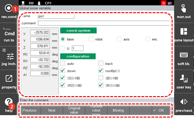

# 9.2.2 Pose Recording Move Statement and Pose Assign Statement

You can edit the pose variable value in the move statement, including the pose variable or the pose variable assign statement.

1.	Touch the \[property\] button in the move command \(move statement\) recorded as a pose variable. Then, the pose variable setting screen will appear.

2.	Check and modify the current pose variable.

    

<table>
  <thead>
    <tr>
      <th style="text-align:left">No.</th>
      <th style="text-align:left">Description</th>
    </tr>
  </thead>
  <tbody>
    <tr>
      <td style="text-align:left">
        
      </td>
      <td style="text-align:left">
        
Current pose variable information. You can check and set the name, coordinate
          value, coordinate system format, etc.

        <ul>
          <li><b>[Name]</b>: Name of the current pose variable</li>
          <li><b>Coordinate value</b>: The coordinate value of the current pose variable
            <ul>
              <li>Select an item using the cursor key.</li>
              <li>After inputting a value in the desired item, press the <b><<b>ENTER</b>></b> key
                to reflect the change.</li>
              <li>If the coordinate system format is set as an encoder, the coordinate value
                will not be changed.</li>
            </ul>
          </li>
          <li><b>[Coord. System]</b>: The coordinate system format to express the position
            of the current pose variable</li>
          <li><b>[Configuration]</b>: When describing the position of the robot, there are
            multiple solutions because of the characteristics of the device, so the
            robot configuration is designated to uniquely describe the configuration.
            <ul>
              <li>This function can only be used when the coordinate system type is set
                as a base or robot.</li>
              <li>For details on the robot configuration, refer to &#x201C;<a href="../../operation/step/step-pose-modify/">2.3.2 Recording and Changing a Step Position</a><b>.</b>&#x201D;</li>
            </ul>
          </li>
        </ul>
      </td>
    </tr>
    <tr>
      <td style="text-align:left">
        
      </td>
      <td style="text-align:left">
        <ul>
          <li><b>[OK]</b>: You can save the changes.</li>
          <li><b>[Previous]/[Next]</b>: You can display the information of the previous or
            next step.</li>
          <li><b>[Original Value]</b>: You can display the original hidden pose value of the
            current step.</li>
          <li><b>[Current Robot Pose]</b>: You can display the value of the pose the robot
            is currently taking.</li>
          <li><b>[Moving]</b>: Touching the button will move the robot to the
            recorded step position (Jog).</li>
        </ul>
      </td>
    </tr>
  </tbody>
</table>

3.	Touch the \[**OK**\] button. Then, the change will be saved in the job program, and the operation will end.

* If you end the operation by pressing the <**ESC**> key, the change will not be saved. 

